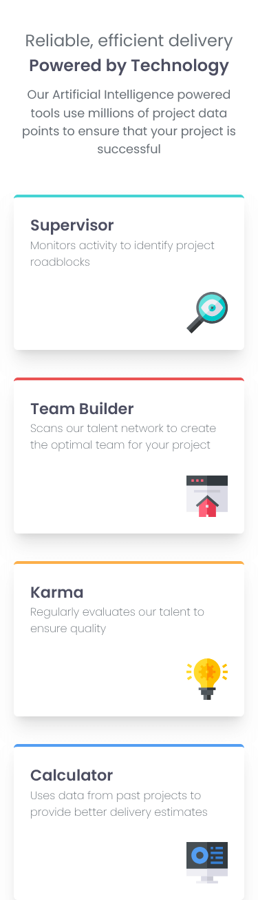
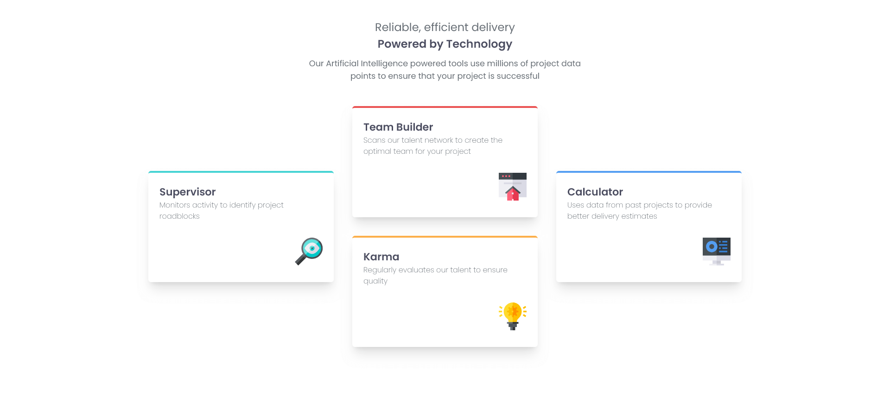

# Frontend Mentor - Four card feature section solution

This is a solution to the [Four card feature section challenge on Frontend Mentor](https://www.frontendmentor.io/challenges/four-card-feature-section-weK1eFYK). Frontend Mentor challenges help you improve your coding skills by building realistic projects.

## Table of contents

- [Overview](#overview)
  - [The challenge](#the-challenge)
  - [Screenshot](#screenshot)
  - [Links](#links)
- [My process](#my-process)
  - [Built with](#built-with)
- [Author](#author)

## Overview

### The challenge

Users should be able to:

- View the optimal layout for the site depending on their device's screen size

### Screenshot

### Links

- Solution URL: [https://github.com/Steno-95/four-card-feature-section](https://github.com/Steno-95/four-card-feature-section)
- Live Site URL: [https://four-card-feature-section-f-m.netlify.app](https://four-card-feature-section-f-m.netlify.app)

## My process

### Built with

- Semantic HTML5 markup
- CSS custom properties
- Flexbox
- CSS Grid
- Mobile-first workflow
- [React](https://reactjs.org/) - JS library
- [Tailwindcss](https://tailwindcss.com/) - For styles

## Author

- Website - [Stefano Lezzi](https://github.com/Steno-95)
- Frontend Mentor - [@Steno-95](https://www.frontendmentor.io/profile/Steno-95)
